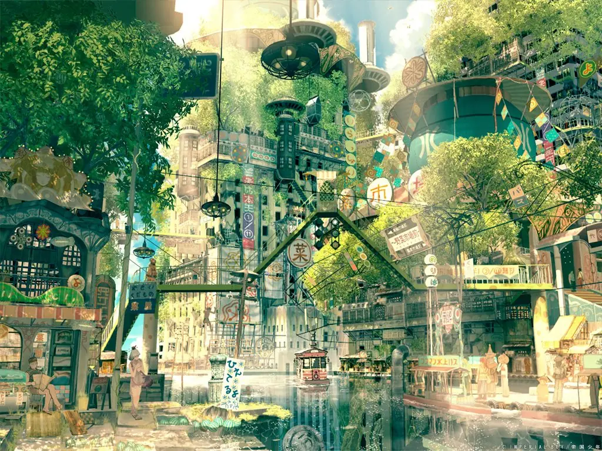

---
# Feel free to add content and custom Front Matter to this file.

layout: default
---
<h1 class="text-6xl lg:text-7xl font-bold primary-color mb-4">סולארפאנק ישראל</h1>
<h3 class="text-xl text-center">תנועה אומנותית-פוליטית לעבר עתיד אופטימי של הרמוניה עם הטבע ושאר בני האדם</h3>

    <figure class="wide-pic">
        
        <figcaption dir="ltr" class="ml-2 text-sm">"Solarpunk Art" by Imperial Boy</figcaption>
    </figure>
    

        

            יותר מדי זמן הדמיון שלנו הוחזק כשבוי ביד האפוקליפסות של הוליווד ("קל יותר לדמיין את סוף העולם מאת סוף הקפיטליזם").  
            אנחנו רוצים לשחרר את הדמיון שלנו לחופשי, שישתולל ויבעט, שיהפוך את כל מה שחשבנו על העתיד על הראש, ויעזור לנו לבנות מצפן לכיוון הנכון.
            

            השאלה המכוננת עבורנו היא השאלה הפשוטה: איך נראה עולם בר קיימא, ואיך אפשר להגיע לשם?
            דרך שחרור הדמיון שלנו לעבר עתיד אופטימי ומחובר למציאות, אנחנו מתחילים במסע רדיקלי לבניית עולם ששם במרכז צרכים אנושיים וצרכים סביבתיים, עולם שמשבר האקלים צומצם ורוב האנושות הצליחה לשרוד את המעבר למצב הרמוני עם הטבע וכלל האנושות.
        

    

<iframe class="w-full" height="500" src="https://www.youtube-nocookie.com/embed/UqJJktxCY9U" title="YouTube video player" frameborder="0" allow="accelerometer; autoplay; clipboard-write; encrypted-media; gyroscope; picture-in-picture" allowfullscreen></iframe>

<h3 class="text-xl mt-8">עוד מידע</h3>

    

        

            
Why Solarpunk gives me hope for the future | Youtube
 
            

                <a class="btn btn-primary custom-bg-primary" href="https://www.youtube.com/watch?v=u3aauiR9M88">            
                    <svg xmlns="http://www.w3.org/2000/svg" fill="none" viewBox="0 0 24 24" class="inline-block w-6 h-6 ml-2 stroke-current">  
                    <path stroke-linecap="round" stroke-linejoin="round" stroke-width="2" d="M9 5l7 7-7 7"></path>                        
                    </svg>
                </a>
            

        

    
 
    

        

            
Solarpunk Is Not About Pretty Aesthetics. It's About the End of Capitalism
        | Vice
 
            

                <a class="btn btn-primary custom-bg-primary" href="https://www.vice.com/en/article/wx5aym/solarpunk-is-not-about-pretty-aesthetics-its-about-the-end-of-capitalism">            
                    <svg xmlns="http://www.w3.org/2000/svg" fill="none" viewBox="0 0 24 24" class="inline-block w-6 h-6 ml-2 stroke-current">  
                    <path stroke-linecap="round" stroke-linejoin="round" stroke-width="2" d="M9 5l7 7-7 7"></path>                        
                    </svg>
                </a>
            

        

    
 
    

        

            
What is solarpunk and can it help save the planet? | BBC
 
            

                <a class="btn btn-primary custom-bg-primary" href="https://www.bbc.com/news/business-57761297">            
                    <svg xmlns="http://www.w3.org/2000/svg" fill="none" viewBox="0 0 24 24" class="inline-block w-6 h-6 ml-2 stroke-current">  
                    <path stroke-linecap="round" stroke-linejoin="round" stroke-width="2" d="M9 5l7 7-7 7"></path>                        
                    </svg>
                </a>
            

        

    
 

